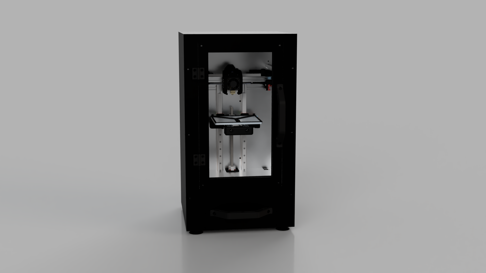
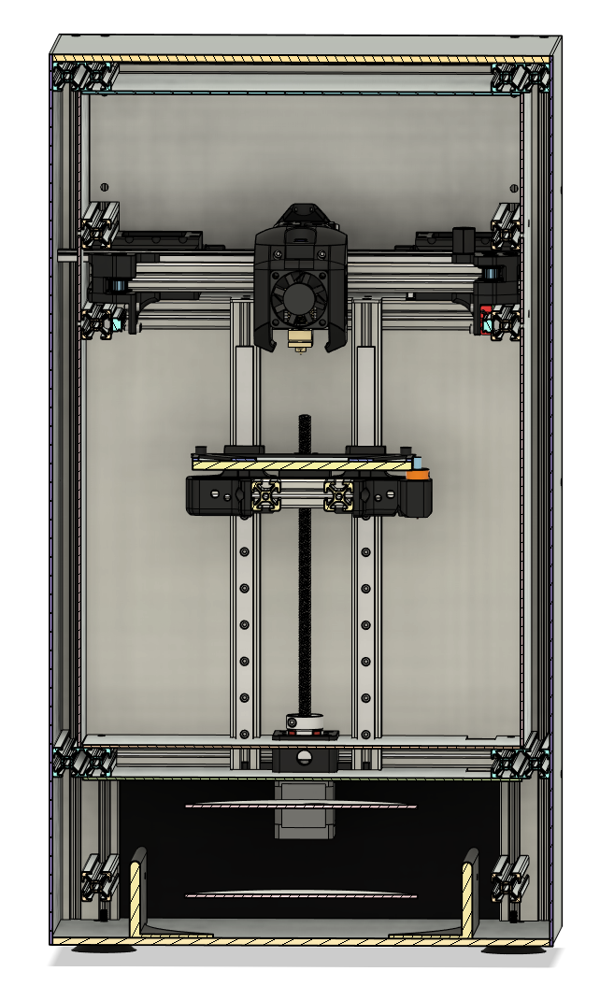
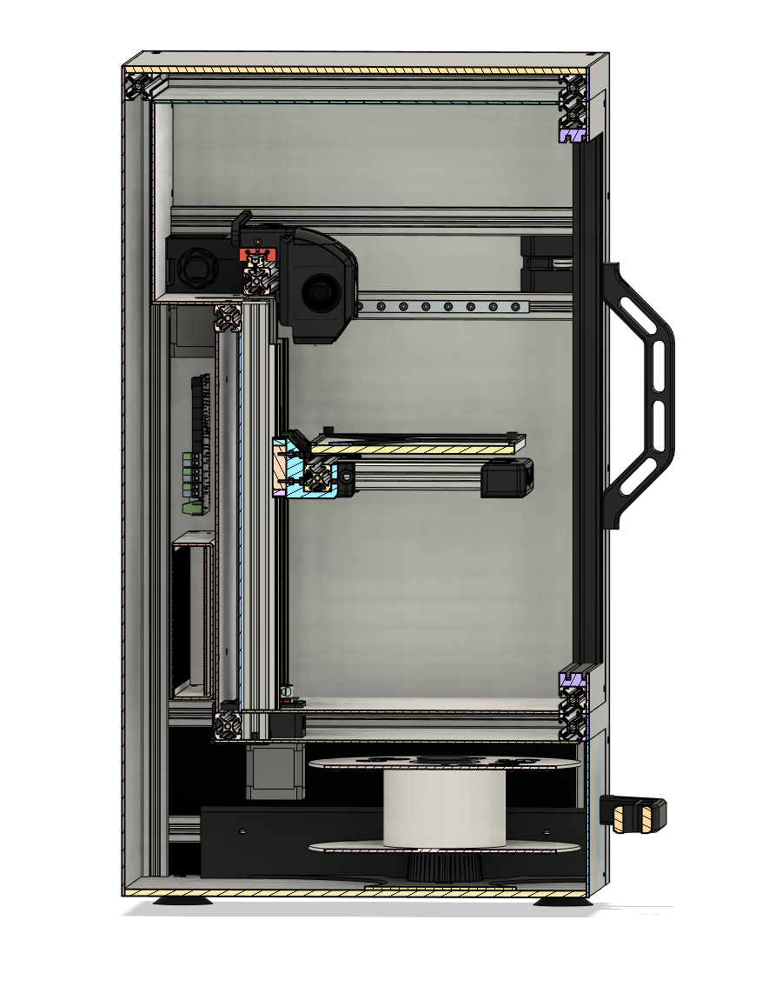

# Doom-M
A heavily modified high temp Tiny-M build.
 
 Initial CAD design description: https://youtu.be/QfLSvSASgaw
 More information about Tiny-M: https://github.com/gsl12/Tiny-M
 More information about Voron v0: https://github.com/VoronDesign/Voron-0
 
### This build is still WIP. All files are released to help you build a similar machine or draw inspiration from. I don't promise that everything will work.
| Front CS | Side CS |
| --- | --- |
|  | |
 
 Check out my YT channel to see this build in progress: https://www.youtube.com/playlist?list=PLJKGITN8zPujpHJXw2BlKhsdbrXcnUU1R
